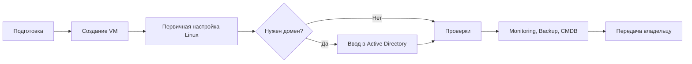

# Linux VM Deployment Runbook

> Публичный учебный пример. Все названия, домены, IP-адреса, учетные записи и процессы вымышлены.

## Для чего нужен проект

Репозиторий описывает общий процесс подготовки и развертывания обычной виртуальной Linux-машины в корпоративной инфраструктуре.

Он дает:

- понятную последовательность действий;
- разделение ответственности между командами;
- контрольные точки перед переходом к следующему этапу;
- основу для внутреннего runbook и будущей автоматизации;
- критерии готовности сервера к передаче владельцу.

Это не готовая production-инструкция. Перед применением ее необходимо адаптировать под конкретные версии ОС, гипервизор, сеть, Active Directory, monitoring, backup и требования безопасности.

## Общая последовательность



## Что дает каждый этап

### 1. Подготовка

Определяются назначение сервера, владелец, ресурсы, IP и DNS, сетевые сегменты, доступ, необходимость домена, backup, monitoring и окно обслуживания.

Результат: согласованный набор входных данных, по которому VM можно создавать без догадок.

### 2. Создание Linux VM

Создается виртуальная машина, подключаются диски и сети, разворачивается ОС, настраиваются hostname, сеть, DNS, время, обновления и базовая защита.

Результат: работающий Linux-сервер с базовой конфигурацией.

### 3. Ввод в домен

Этап выполняется только при необходимости доменной аутентификации. Проверяются DNS и время, сервер присоединяется к Active Directory, а доступ ограничивается согласованными группами.

Результат: Linux-сервер корректно использует доменные учетные записи.

## Структура репозитория

```text
.
├── README.md
├── docs
│   ├── 01-preparation.md
│   ├── 02-vm-creation.md
│   └── 03-domain-join.md
├── examples
│   ├── cloud-init.yaml
│   ├── netplan-single-nic.yaml
│   ├── netplan-dual-nic.yaml
│   └── rhel-network-nmcli.sh
└── SECURITY.md
```

## Основные принципы

- Не хранить пароли, токены и private keys в Git.
- Не публиковать реальные внутренние адреса, имена и скриншоты административных систем.
- Не привязывать процесс к конкретному сотруднику — использовать роли и группы.
- Не применять команды без проверки версии ОС.
- Изменения сети выполнять с доступом к консоли гипервизора.
- Перед изменением PAM, sudo, сети или доменной конфигурации иметь план отката.
- Повторяемые действия по возможности автоматизировать.

## Тестовые значения

В примерах используются только безопасные значения для документации:

- домен: `corp.example.com`;
- VM: `linux-vm-01.corp.example.com`;
- основная сеть: `192.0.2.0/24`;
- дополнительная сеть: `198.51.100.0/24`;
- тестовая маршрутная сеть: `203.0.113.0/24`.

